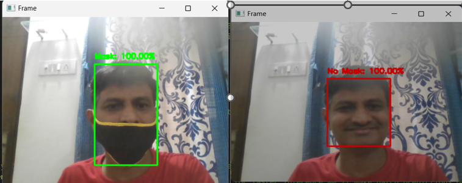

# face-mask-project
USING CNN  - Deep Learning (DL): 🤖
TensorFlow: 🔧
Keras: 🧩
Face Mask Detection: 📝
Model Saving: 💾

# Table of Contents

- [Overview](#overview)
- [Installation](#Installation)
- [Usage](#Usage)
- [Contribution](#contribution)
- [License](#license)
- [Contact](#contact)

## Overview
In this Project, We are building a Face Mask Detector using Keras, Tensorflow, MobileNet and OpenCV. 
We will also see how to apply this on a Live Video Camera.
With further improvements these types of models could be integrated with CCTV cameras to detect and identify people without masks.

The face mask detector didn't use any morphed masked images dataset. The model is accurate, and since the MobileNetV2 architecture is used,
 it’s also computationally efficient and thus making it easier to deploy the model to embedded systems (Raspberry Pi, Google Coral, etc.).




## Installation

1. Clone this repository to your build machine using:

```bash
  git clone https://github.com/alexvatti/face-mask-project.git
```
2. Navigate to the project directory:

```bash
  cd face-mask-project
```
3. Install the required dependencies using pip:

```bash
  pip install -r requirements.txt
```

4. Open the Jupyter Notebook - Run the Code on the Choice of Platforms (Local/Google Colab/Kaggle)

```   
 Face-Mask-Detector.ipynb
```
## Usage

1. Run the Python app by executing:
```bash
python.exe  face_mask_detect_app.py
```

2.The app will open the camera - face your head to camera , It will show With Mask/With Out Mask.

## Contribution

Feel free to contribute and enhance the project!

## License
This project is licensed under the [MIT License](LICENSE).

## Contact
For any inquiries or issues, please contact Alex at alexvatti@gmail.com

